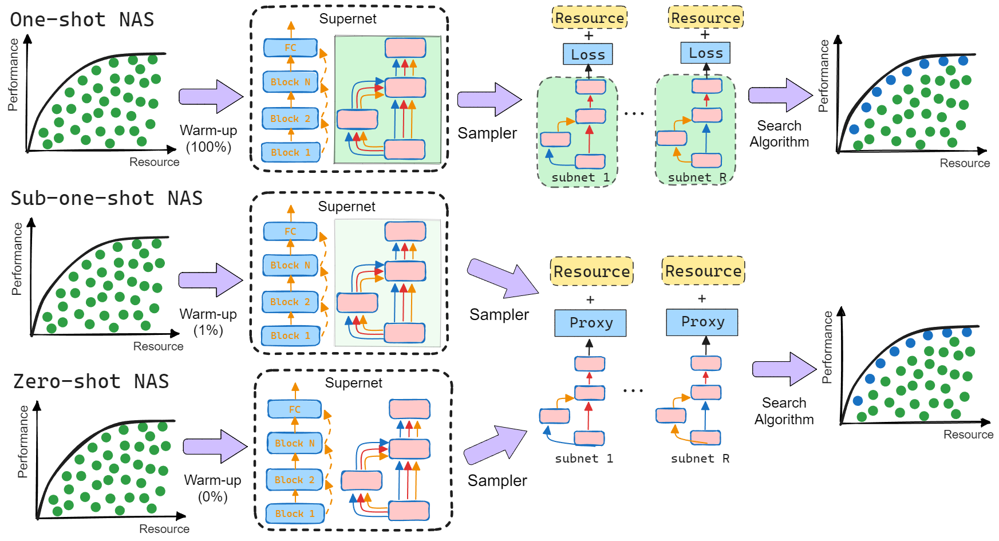
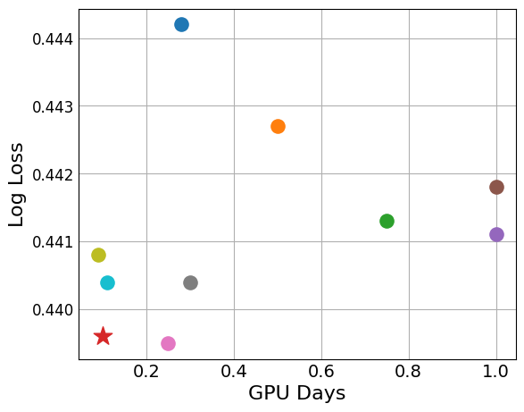
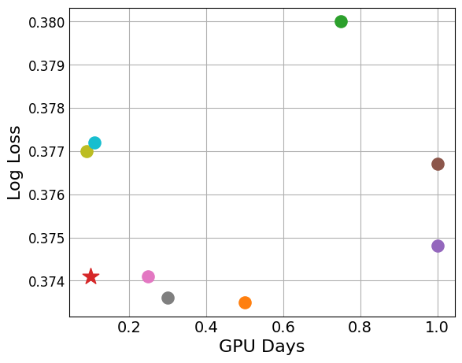
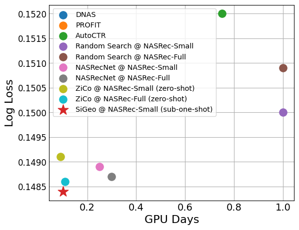

# SiGeo: Sub-One-Shot NAS via Information Theory and Geometry of Loss Landscape
This is the official code of our work, [**SiGeo: Sub-One-Shot NAS via Geometry of Loss Landscape**] 
This work is based on the original [NasRec](https://github.com/facebookresearch/NasRec), a design automation for Click-Through Rate (CTR) prediction task on 
Recommender Systems.

The SiGeo proxy `compute_zero_shot_metric` is defined in "nasrec/utils/train_utils.py".

## Highlights

* NASRec utilizes a flexible search space,  supporting dense connectivity of heterogenous building operators.



* SiGeo-NAS achieves the state-of-the-art results on 3 CTR applications, with significantly better computational efficiency.

|                       Criteo                       |             Avazu              |         KDD Cup 2012         |
|:--------------------------------------------------:|:------------------------------:|:----------------------------:|
|  |  |  |


| Warm-up Level | Current Training Loss | Current Training Loss | Fisher-Rao Norm | Fisher-Rao Norm | Mean Absolute Gradients | Mean Absolute Gradients |
|---------------|:----------------------|-----------------------|-----------------|-----------------|:-----------------------:|-------------------------|
| Warm-up Level | Spearman              | Kendall               | Spearman        | Kendall         |        Spearman         | Kendall                 |
| 0%            | 0.30                  | 0.21                  | -0.31           | -0.21           |          -0.48          | -0.34                   |
| 10%           | 0.71                  | 0.52                  | -0.61           | -0.44           |          -0.54          | -0.40                   |
| 20%           | 0.79                  | 0.61                  | -0.70           | -0.52           |          -0.57          | -0.42                   |
| 40%           | 0.80                  | 0.61                  | -0.71           | -0.53           |          -0.58          | -0.43                   |
| 60%           | 0.82                  | 0.63                  | -0.71           | -0.52           |          -0.58          | -0.44                   |
| 80%           | 0.83                  | 0.64                  | -0.71           | -0.51           |          -0.58          | -0.44                   |
| 100%          | 0.85                  | 0.66                  | -0.69           | -0.51           |          -0.59          | -0.44                   |


## Empirical Justification for the Theory
The result in Section 5.2 can be reproduced by using the notebook located at `notebooks/EmpiricalJustification4Theory.ipynb`

## Example for Recommender System Benchmarks (Section 5.4)
**Step 1**: Warm up the supernet. The warm-up level can be changed by changing `train_limit` argument. For example, 
for one-shot (100% warm-up), use `36672495` samples; for 10% warm-up, use `3667250` samples;  for 1% warm-up, 
use `366725` samples.
```bash
LR=0.12
WD=0
setting=0.01

python -u nasrec/train_supernet.py \
  --learning_rate $LR \
  --gpu 0 \
  --root_dir ./data/criteo_kaggle_autoctr \
  --train_batch_size 512 \
  --strategy default \
  --anypath_choice binomial-0.5 \
  --logging_dir ./www-test/criteo_1shot/criteo-supernet-default-binomial_0.5-autoctr_lr${LR}-${setting} \
  --test_batch_size 4096 \
  --use_layernorm 1 \
  --supernet_training_step 15000 \
  --config autoctr \
  --num_blocks 7 \
  --num_epochs 1 \
  --test_interval 2000 \
  --wd $WD \
  --train_limit 36672495 \
  --test_limit 4584061

```

**Step 2**: Search the top subnets from NASRec-Small and the results will be saved at `LOGGING_DIR`
```bash
zico_coef=1
fr_coef=1
loss_coef=0
setting=0.01data

CKPT_PATH=./www-test/criteo_1shot/criteo-supernet-default-binomial_0.5-autoctr_lr0.12-${setting}/supernet_7blocks_layernorm1_default-binomial-0.5_lr0.12_supernetwarmup_15000/supernet_checkpoint.pt
LOGGING_DIR=./www-test/criteo_1shot/criteo-supernet-default-binomial-0.5-autoctr-ea-240gen-128pop-64sample-8childs-default-ft_lr0.04-${zico_coef}zico-${fr_coef}fr-${setting}

python -u nasrec/eval_subnet_from_supernet.py \
    --root_dir ./data/criteo_kaggle_autoctr/ \
    --ea_top_k 2 \
    --ckpt_path $CKPT_PATH \
    --learning_rate 0.04 \
    --wd 0 \
    --logging_dir $LOGGING_DIR \
    --n_childs 8 \
    --n_generations 240 \
    --init_population 128 \
    --sample_size 64 \
    --method regularized-ea \
    --use_layernorm 1 \
    --max_train_steps 500 \
    --train_batch_size 512 \
    --test_batch_size 8192 \
    --num_parallel_workers 8 \
    --max_eval_steps 150 \
    --config autoctr \
    --test_only_at_last_step 1 \
    --finetune_whole_supernet 0 \
    --zeroshot zico-fr \
    --zico_coef ${zico_coef} \
    --fr_coef ${fr_coef} \
    --loss_coef ${loss_coef}
```
**Step 3**: generate the top-15 model configs and save them as json files to 
`ea-${data}-kaggle-autoctr-best-1shot-sigeo/best_config_${ID}.json` using the notebook at `notebooks/dump_ea_records.ipynb`.

**Step 4**: Select the best subnet from top-15 models.
```bash
LR=0.1
ID=0
gup_id=7
data=criteo # avazu
datapath=${data}_kaggle_autoctr
score=sigeo

# CUDA_VISIBLE_DEVICES=7
python -u nasrec/main_train.py --root_dir ./data/${datapath}/ \
        --net supernet-config \
        --supernet_config ea-${data}-kaggle-autoctr-best-1shot-${score}/best_config_${ID}.json \
        --num_epochs 1 \
        --learning_rate ${LR} \
        --train_batch_size 256 \
        --wd 0 \
        --logging_dir ./www-test/ea-best-${data}-kaggle-${score}-config-${ID} \
        --gpu ${gup_id} \
        --test_interval 10000 \
        --dataset ${data}-kaggle \
        --train_limit 41256556 \
        --test_limit 4584061

```

## Requirements
We export the conda environment of NASRec project in `environment.yml`. You can install all requirements via the following command:

```bash
conda env create -f environment.yml
```

## Full documentation
Below is a brief review of this project:
```
nasrec
│   README.md
│
└───configs
│   SuperNet configurations, including the best models.
│   │   avazu
│   │   criteo   
│   │   kdd   
└───scripts
    │   eval_best_candidate
    │   eval_best_model
    |   run_ea
    |   train_subnet            (Not needed in the flow)
    |   train_supernet          (Supernet training script. Feel free to explore yourself for now!)
```
Most functions of the scripts/modules are suggested by the folder names. We are working on some tutorials to faciliate NASRec, and promote future line of research on recommender systems. Stay tuned!

